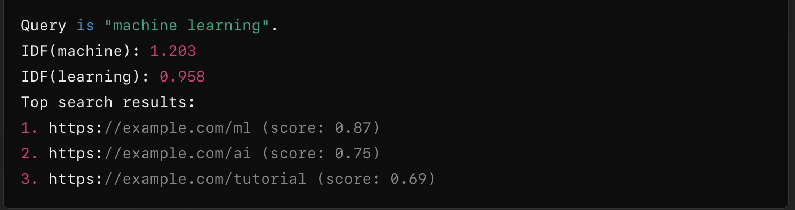

Web Crawler & Search Indexer 

Overview 
This project implements a web crawler, indexer, and search engine that retrieves webpages, extracts relevant terms, and ranks them using TF-IDF scoring. 

Features 
Web Crawler: Uses curl to fetch webpages and extract links. 
Indexer: Implements a trie-based structure to store word occurrences. 
Search Engine: Uses TF-IDF ranking to find and rank relevant pages. 
Memory Management: Allocates and deallocates memory efficiently to prevent leaks. 

Files

File Description 
crawler.c: Crawls web pages and extracts links. 
index.c: Indexes web pages and builds a trie structure for word storage. 
webSearch.c: Processes user queries and ranks results using TF-IDF. 

Compilation & Usage 
Compile the program: gcc -o crawler crawler.c index.c webSearch.c -lm 
Run the web crawler: ./crawler <urlFile> <maxPages> <seed> 
<urlFile>: File containing seed URLs. <maxPages>: Maximum number of pages to crawl. <seed>: Random seed for link selection.
Query the indexed pages: ./webSearch <urlFile> <maxPages> <seed>

